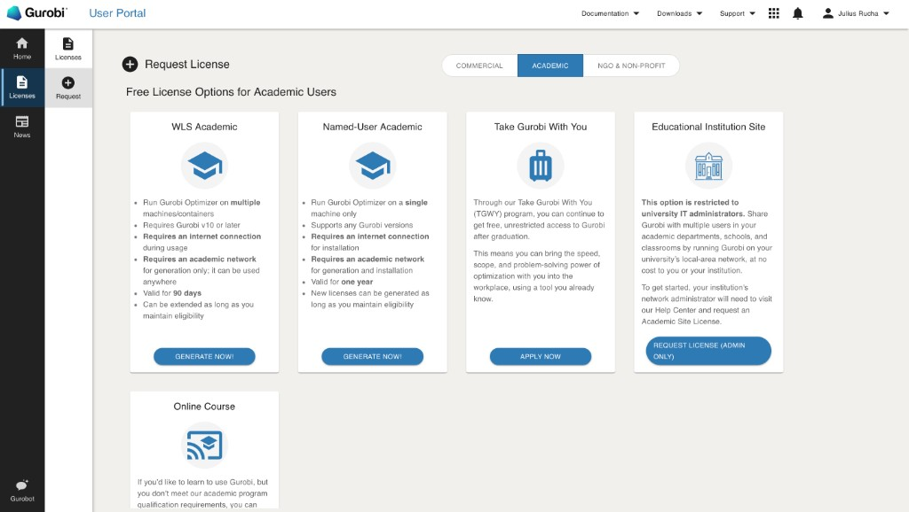
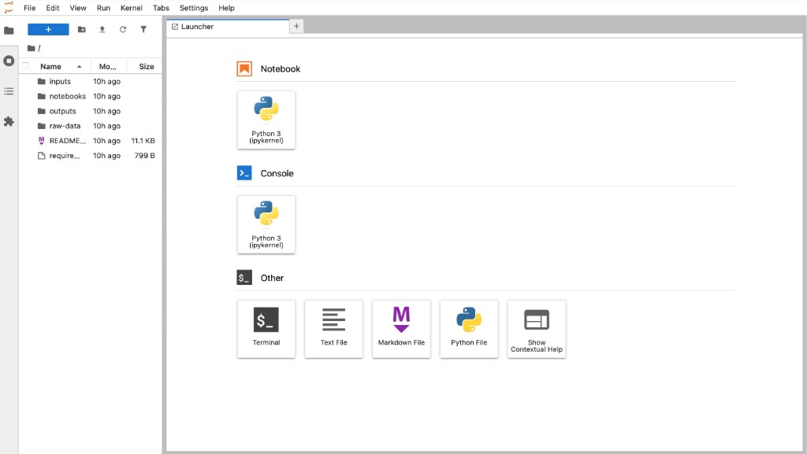

# Household Flexibility & Grid Tariff Incentives — Computational Bundle

**Thesis:** *Assessing the Impact of Grid Tariff Designs on Total Electricity Costs and Flexibility Incentives: Simulation of Standardised Household Profiles across German Distribution System Operators*

**Author:** Julius Rucha · University of St. Gallen (HSG) and Rotterdam School of Management (RSM) · Master Thesis 2026

---

## 1. Overview

This repository contains the full computational bundle accompanying the thesis. It includes all input generation notebooks, frozen input time series, optimisation solver notebooks, frozen results, and analysis code — sufficient to audit, understand, and (if desired) reproduce every quantitative result reported in Chapters 3–5.

The experimental design covers **8 household archetypes × 7 DSOs × 3 operational strategies = 168 model runs** for Germany, using 2025 spot prices and 2026 network tariffs. The central outputs are the Total Cost of Electricity (TCoE) decomposition, Net Flexibility Incentive (NFI), and Net Incentive Ratio (NIR) across all archetype–DSO cells, plus the fuzzy-set QCA (fsQCA) pipeline: case-level conditions and calibrated **LOW_NIR** outcome, **configuration-level** sufficiency truth table, **necessity** screen, calibration anchors, and robustness checks — implemented in `notebooks/03_analysis/01_nfi_nir_fsqca.ipynb` (NFI/NIR + fsQCA exports) and `notebooks/03_analysis/02_tcoe_summary_tables.ipynb` (Chapter 5 monetary summary tables), with CSV artefacts exported beside each notebook.

---

## 2. Requirements

### Python (tested on macOS)
Python **3.12** is recommended. Dependencies are listed in `requirements.txt` and installed with `pip`.

### Solver (Gurobi required to reproduce solvers)
All optimisation notebooks in `notebooks/02_solver/` use **Gurobi** via `gurobipy` / PuLP. A valid academic Gurobi licence is required to reproduce the solver runs (see: [gurobi.com/academia](https://www.gurobi.com/academia/academic-program-and-licenses/)).

This repository was reproduced on macOS with a **Named-User Academic** Gurobi licence.



> **Reviewers who prefer not to re-run the solvers:** All solver outputs are pre-committed as frozen CSVs in `outputs/`. You can skip Step 2 and run only the analysis notebooks.

### Quickstart (macOS, tested)
1) **Download**
- GitHub → **Code** → **Download ZIP**
- Unzip locally. The folder name may vary.

2) **Open Terminal in the repository root**
- Finder: right‑click the folder → **Services** (German: **Dienste**) → **New Terminal at Folder** (German: **Neues Terminal beim Ordner**)  
  If you do not see that option: open Terminal, type `cd ` (with a trailing space), then drag the unzipped folder into the Terminal window and press Enter.

3) **Create a clean environment and install dependencies**
Run:

```bash
python3 -m venv .venv
source .venv/bin/activate
python -m pip install --upgrade pip
pip install -r requirements.txt
```

4) **Run notebooks**
Start JupyterLab:

```bash
./.venv/bin/python -m jupyterlab
```

If your browser does not open automatically, you can open JupyterLab manually at:

```bash
http://localhost:8888/lab
```

Once JupyterLab is running, the launcher should look similar to the following (file browser on the left with `inputs/`, `notebooks/`, and `outputs/` at the repository root):



Open the notebooks under `notebooks/` and run them as described in Section 4 (Execution Order).

### Windows / Linux (not validated by the author)
The workflow is standard Python/Jupyter practice. Please follow your platform’s best practices (or consult an AI assistant / local IT support) to:
- open a terminal in the repository root (folder containing `requirements.txt`),
- create/activate a virtual environment,
- install dependencies from `requirements.txt`,
- launch Jupyter and run the notebooks.

---

## 3. Repository Structure

```
.
├── raw-data/                        # Frozen raw source files as downloaded
│   ├── BDEW_Standardlastprofile_Strom_retrieved_2026-02.xlsx
│   ├── ENTSO-E_DayAhead_DE-LU_2025_retrieved_2026-02.xlsx
│   ├── EVR_ProfilHZ2_retrieved_2026-02.xls
│   ├── renewablesninja_pv_kassel_10kWp_merra2_2019_retrieved_2026-02.csv
│   └── renewablesninja_weather_kassel_merra2_2019_retrieved_2026-02.csv
│
├── inputs/                          # Processed time series and parameter files
│   │                                # (generated by notebooks/01_input_generation/)
│   ├── base_demand_h25_4500kwh_2026_15min.csv
│   ├── spot_prices_de_lu_2025_15min.csv
│   ├── pv_kassel_10kwp_2026_15min.csv
│   ├── weather_kassel_t2m_2019_hourly.csv
│   ├── hp_kassel_hz2_2026_15min.csv
│   ├── hp_hz2_parameters_kassel_2026.csv
│   ├── ev_profile_representative_50kwh_11kw_2026_15min.csv
│   ├── ev_parameters_representative_50kwh_11kw_2026.csv
│   ├── bss_parameters_prosumer_10kwh_2026.csv
│   ├── dso_tariffs_residential_2026.csv
│   ├── dso_mod3_timebands_2026.csv
│   └── residential_taxes_2026.csv
│
├── notebooks/
│   ├── 01_input_generation/         # How each input CSV was produced from raw sources
│   │   ├── 01_base_demand_h25_4500kwh_2026.ipynb
│   │   ├── 02_spot_prices_de_lu_2025.ipynb
│   │   ├── 03_pv_generation_kassel_10kwp_2026.ipynb
│   │   ├── 04_weather_kassel_merra2_2019.ipynb
│   │   ├── 05_hp_demand_kassel_hz2_4500kwh_2026.ipynb
│   │   ├── 06_ev_profile_50kwh_11kw_2026.ipynb
│   │   ├── 07_bss_parameters_10kwh.ipynb
│   │   ├── 08_dso_tariffs_2026.ipynb
│   │   └── 09_germany_taxes_levies_2026.ipynb
│   │
│   ├── 02_solver/                   # One notebook per archetype — no-flex / DT-flex / TCoE-flex
│   │   ├── 01_archetype_base.ipynb              # Archetype 1: Base only
│   │   ├── 02_archetype_base_pv.ipynb           # Archetype 2: Base + PV
│   │   ├── 03_archetype_base_pv_bss.ipynb       # Archetype 3: Base + PV + BSS
│   │   ├── 04_archetype_base_hp.ipynb           # Archetype 4: Base + HP+HS
│   │   ├── 05_archetype_base_ev.ipynb           # Archetype 5: Base + EV
│   │   ├── 06_archetype_base_pv_hp.ipynb        # Archetype 6: Base + PV + HP+HS
│   │   ├── 07_archetype_base_pv_ev.ipynb        # Archetype 7: Base + PV + EV
│   │   └── 08_archetype_base_pv_bss_hp_ev.ipynb # Archetype 8: Full Stack (MILP)
│   │
│   └── 03_analysis/                 # NFI / NIR, fsQCA, and TCoE summary tables (CSV exports co-located here)
│       ├── 01_nfi_nir_fsqca.ipynb   # Compute NFI/NIR and fsQCA exports (Germany 2026)
│       ├── nfi_nir_germany_2026.csv                      # 8×7 rows: TCoE by strategy + NFI_eur + NIR
│       ├── fsqca_conditions_germany_2026.csv             # N = 42 flexible cases: crisp/fuzzy conditions + LOW_NIR
│       ├── fsqca_calibration_anchors_germany_2026.csv    # p25 / median / p75 anchors (LOW_NIR, MOD3_SIGNAL, DSO_VOL_LEVEL)
│       ├── fsqca_truth_table_germany_2026.csv            # Configuration-level sufficiency (16 populated rows)
│       ├── fsqca_necessity_screen_germany_2026.csv       # Elementary necessity expressions vs. LOW_NIR
│       ├── 02_tcoe_summary_tables.ipynb                  # Chapter 5.1–5.2 style monetary tables from outputs/
│       ├── tcoe_mean_spread_by_archetype_strategy_2026.csv
│       ├── tcoe_flex_matrix_archetype_dso_2026.csv
│       └── tcoe_strategy_savings_2026.csv
│
├── outputs/                         # Frozen solver results — available without re-running solvers
│   ├── results_base_2026.csv                  # Archetype 1
│   ├── results_base_pv_2026.csv               # Archetype 2
│   ├── results_base_pv_bss_2026.csv           # Archetype 3
│   ├── results_base_hp_2026.csv               # Archetype 4
│   ├── results_base_ev_2026.csv               # Archetype 5
│   ├── results_base_pv_hp_2026.csv            # Archetype 6
│   ├── results_base_pv_ev_2026.csv            # Archetype 7
│   └── results_base_pv_bss_hp_ev_2026.csv     # Archetype 8
│
└── requirements.txt
```

---

## 4. Execution Order

Steps 1 and 2 are **optional** — all inputs and outputs are pre-committed as frozen files.

**Step 1 — (Optional) Regenerate input time series**

Run notebooks in `notebooks/01_input_generation/` in any order. Each notebook documents its raw data source (see Section 5) and writes to `inputs/`.

**Step 2 — (Optional) Re-run solvers**

Run each notebook in `notebooks/02_solver/` independently (order does not matter). Each notebook:
- loads all required inputs from `inputs/`
- runs no-flex (rule-based), DT-flex (LP/MILP, spot signal), and TCoE-flex (LP/MILP, full cost stack) for all 7 DSOs
- writes results to `outputs/results_<archetype>_2026.csv`

Expected runtime: 2–5 min (Archetypes 1–7) · about 10–15 min (Archetype 8 full-stack MILP, Gurobi).

**Step 3 — Compute NFI/NIR and fsQCA artefacts (no Gurobi)**

Run `notebooks/03_analysis/01_nfi_nir_fsqca.ipynb` to compute the full Germany 2026 NFI/NIR grid and all fsQCA artefacts (conditions, calibration anchors, truth table, necessity screen) and export them as CSV files to `notebooks/03_analysis/`. Then run `notebooks/03_analysis/02_tcoe_summary_tables.ipynb` to reproduce the main summary tables derived from the TCoE outputs.

No Gurobi licence required for Step 3.

---

## 5. Data Sources

| Input file | Notebook | Primary source |
|---|---|---|
| `base_demand_h25_4500kwh_2026_15min.csv` | `01_` | BDEW Standardlastprofil H25 — rescaled to 4,500 kWh/year |
| `spot_prices_de_lu_2025_15min.csv` | `02_` | ENTSO-E Transparency Platform, DE/LU day-ahead 2025 |
| `pv_kassel_10kwp_2026_15min.csv` | `03_` | renewables.ninja (MERRA-2, 2019), 10 kWp Kassel |
| `weather_kassel_t2m_2019_hourly.csv` | `04_` | renewables.ninja (MERRA-2, 2019), 2 m air temperature |
| `hp_kassel_hz2_2026_15min.csv` | `05_` | Bayernwerk HZ2 methodology + EVR profile matrix, 4,500 kWh/year |
| `ev_profile_representative_50kwh_11kw_2026_15min.csv` | `06_` | Stylised commuter pattern; EV parameter defaults documented against Stute et al. (2024) — full reference below |
| `bss_parameters_prosumer_10kwh_2026.csv` | `07_` | Li-ion prosumer BSS defaults (Table 4) from Stute et al. (2024) — full reference below |
| `dso_tariffs_residential_2026.csv` | `08_` | Seven DSO official tariff publications, retrieved Feb 2026 |
| `dso_mod3_timebands_2026.csv` | `08_` | DSO §14a Module 3 HT/NT/ST time-window specifications |
| `residential_taxes_2026.csv` | `09_` | Vattenfall (2026); KAV §2 |

Full source attribution and retrieval URLs are documented inside each notebook in `notebooks/01_input_generation/`.

---

## 6. Thesis Chapter Mapping

| Thesis chapter | Corresponding code / data |
|---|---|
| Chapter 3 — Data & Calibration | `notebooks/01_input_generation/` · `inputs/` |
| Chapter 4 — Methodology & Model | `notebooks/02_solver/` |
| Chapter 5 — Germany Results (TCoE) | `outputs/results_*.csv` |
| Chapter 5 — TCoE results (Sections 5.1–5.2) | `notebooks/03_analysis/02_tcoe_summary_tables.ipynb` · `tcoe_mean_spread_*.csv` · `tcoe_flex_matrix_*.csv` |
| Chapter 5 — NFI / NIR & fsQCA (main text + figures) | `notebooks/03_analysis/01_nfi_nir_fsqca.ipynb` · `nfi_nir_germany_2026.csv` · `fsqca_conditions_germany_2026.csv` |
| Appendix B — Calibration anchors (Appendix B.1) | `fsqca_calibration_anchors_germany_2026.csv` |
| Appendix B — Truth table (Appendix B.2) | `fsqca_truth_table_germany_2026.csv` |
| Appendix B — Necessity screen (Appendix B.3) | `fsqca_necessity_screen_germany_2026.csv` |
| Appendix B — DSO condition scores (Appendix B.4) | `inputs/dso_tariffs_residential_2026.csv` |
| Appendix B — Case-to-configuration map (Appendix B.5) | `fsqca_conditions_germany_2026.csv` |

---
